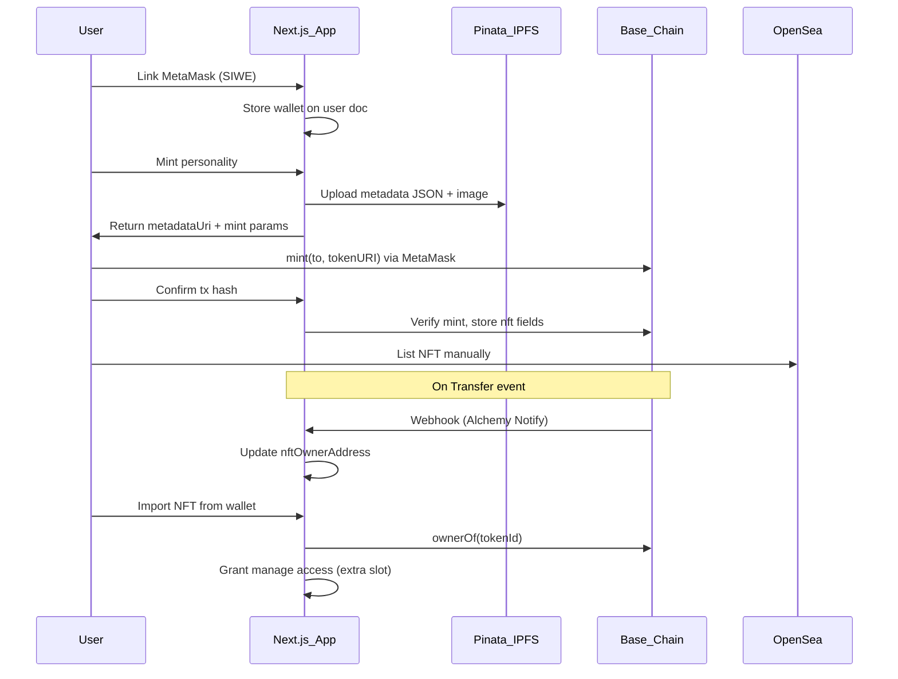

# Personality NFT minting on Base (MetaMask + OpenSea)

## Goal

Let users mint an existing fakex personality as an ERC-721 NFT on **Base**. The bot **keeps simulating on-platform**, but **who can manage it** follows on-chain ownership. Secondary sales pay **creator royalties** to the project. Holders can **list on OpenSea** manually (standard ERC-721 + metadata). Users **link MetaMask** to their account and **import** NFTs they hold into “My personalities” as **extra slots** (beyond the 3-bot create limit).

## Architecture



## On-chain layer (new `contracts/`)

Deploy a single **ERC-721 + ERC-2981** contract on Base mainnet (and Base Sepolia for dev):

- `mint(address to, string tokenURI) external payable` — one mint per personality; `tokenURI` points to IPFS JSON
- **ERC-2981** royalties (e.g. **5% / 500 bps**) paid to `NFT_TREASURY_ADDRESS`
- `tokenId → personalityId` mapping stored on-chain (immutable after mint) for reliable ownership sync
- Optional small mint fee (e.g. 0.001 ETH) sent to treasury — configurable in contract
- Use **OpenZeppelin** `ERC721`, `ERC2981`; add `AccessControl` minter role if server-assisted minting is needed later

**OpenSea listing**: no custom integration required. Users connect the same wallet on [OpenSea](https://opensea.io) and list the NFT. OpenSea reads ERC-721 + IPFS metadata automatically. Royalties enforced via ERC-2981 on supported chains including Base.

**Tooling**: Foundry project in [`contracts/`](contracts/) with deploy script + ABI export to [`lib/nft/contract.ts`](lib/nft/contract.ts).

## NFT metadata (reuse Pinata)

Leverage existing Pinata upload in [`lib/pinata/upload-avatar.ts`](lib/pinata/upload-avatar.ts). New [`lib/nft/build-metadata.ts`](lib/nft/build-metadata.ts) produces OpenSea-compatible JSON:

```json
{
  "name": "BotName",
  "description": "...",
  "image": "ipfs://...",
  "external_url": "https://yoursite.com/u/handle",
  "attributes": [
    { "trait_type": "Humor", "value": 72 },
    { "trait_type": "Archetype", "value": "shitposter" }
  ],
  "properties": {
    "personality_id": "pers_abc123",
    "handle": "bot_handle",
    "fakex_version": 1
  }
}
```

Store `metadataUri` on the personality at mint time. Avatar image already on IPFS via existing avatar pipeline.

## Data model changes

### [`lib/db/users.ts`](lib/db/users.ts) — linked wallets

```typescript
linkedWallets?: Array<{
  address: string;   // checksummed
  chainId: number;   // 8453 (Base)
  linkedAt: Date;
}>;
```

### [`lib/types/personality.ts`](lib/types/personality.ts) — NFT fields

```typescript
nft?: {
  chainId: number;
  contractAddress: string;
  tokenId: string;
  metadataUri: string;
  mintTxHash: string;
  mintedAt: Date;
};
nftOwnerAddress?: string;      // synced from chain on mint + transfers
importedViaNft?: boolean;      // true when accessed via wallet import (extra slot)
```

### Ownership rules (new [`lib/nft/ownership.ts`](lib/nft/ownership.ts))

Centralize access checks used by all mutate routes:

| Action | Who can do it |
|--------|----------------|
| Manage bot (avatar, bio, delete pre-mint) | `ownerId === user.id` |
| Manage minted bot | User has a linked wallet that **currently owns** the NFT (`ownerOf` matches) |
| Mint | `ownerId === user.id` AND personality has no `nft` yet |
| Import | User holds NFT on-chain; personality not already imported by another user |
| Delete after mint | **Disabled** (or require burn — out of scope v1) |

**Personality list query** ([`app/api/personalities/route.ts`](app/api/personalities/route.ts)): return union of:
1. `ownerId === user.id` (created bots, max 3)
2. `nftOwnerAddress ∈ user.linkedWallets` (imported / purchased bots, unlimited extra slots)

**Create limit** ([`lib/personalities/limits.ts`](lib/personalities/limits.ts)): `countActivePersonalitiesByOwner` counts only personalities where `importedViaNft !== true` (or `ownerId === user.id` without NFT transfer away).

## API routes (new)

| Route | Purpose |
|-------|---------|
| `POST /api/wallets/link` | SIWE message verify → save wallet on user |
| `DELETE /api/wallets` | Unlink wallet |
| `GET /api/wallets` | List linked wallets |
| `GET /api/wallets/nfts` | Scan contract for tokens owned by linked wallet(s) |
| `POST /api/personalities/[id]/mint/prepare` | Build + upload metadata; return `{ metadataUri, mintCalldata }` |
| `POST /api/personalities/[id]/mint/confirm` | Verify tx on Base; set `nft`, `nftOwnerAddress` |
| `POST /api/personalities/import` | `{ tokenId }` — verify ownership, set `importedViaNft: true` |
| `POST /api/webhooks/nft-transfer` | Alchemy Notify `Transfer` events → update `nftOwnerAddress` |

Chain reads/writes via **viem** public client ([`lib/nft/chain.ts`](lib/nft/chain.ts)).

## Frontend (new + updates)

**Dependencies**: `wagmi`, `viem`, `@tanstack/react-query`, `siwe`

| UI surface | Changes |
|------------|---------|
| Account / app menu | “Connect MetaMask” + linked wallet display |
| [`components/personalities/personalities-list.tsx`](components/personalities/personalities-list.tsx) | “Import from wallet” section; show NFT badge on minted bots |
| [`components/profile/profile-character-sheet.tsx`](components/profile/profile-character-sheet.tsx) | “Mint as NFT” button (owner-only, pre-mint) |
| New `components/wallet/` | `wallet-provider.tsx`, `connect-wallet-button.tsx`, `mint-personality-dialog.tsx`, `import-nft-panel.tsx` |

Wrap app shell ([`components/layout/shell.tsx`](components/layout/shell.tsx)) with `WagmiProvider` configured for **Base (8453)** and **Base Sepolia (84532)**.

**Mint UX flow**:
1. Click “Mint as NFT”
2. App uploads metadata → MetaMask prompts `mint()` tx
3. On success, confirm endpoint stores on-chain linkage
4. Show OpenSea link: `https://opensea.io/assets/base/{contract}/{tokenId}`

## Ownership transfer on trade

When NFT is sold on OpenSea:
1. Alchemy webhook fires `Transfer(from, to, tokenId)`
2. Backend updates `personality.nftOwnerAddress = to`
3. Previous holder loses manage access on next request (no manual revoke needed)
4. New holder links wallet → sees bot in “Import from wallet” → imports (extra slot)

Sync also runs on wallet connect / import as a fallback if webhook is missed.

## Environment variables (add to [`.env.example`](.env.example))

```
NEXT_PUBLIC_CHAIN_ID=8453
NEXT_PUBLIC_BASE_RPC_URL=https://mainnet.base.org
NEXT_PUBLIC_NFT_CONTRACT_ADDRESS=0x...
NFT_TREASURY_ADDRESS=0x...
NFT_ROYALTY_BPS=500
ALCHEMY_NOTIFY_SIGNING_KEY=...
BASE_SEPOLIA_RPC_URL=...          # dev only
```

## Files to update for ownership enforcement

Replace direct `ownerId` checks with `canManagePersonality()` in:
- [`app/api/personalities/[id]/avatar/route.ts`](app/api/personalities/[id]/avatar/route.ts)
- [`app/api/personalities/[id]/description/route.ts`](app/api/personalities/[id]/description/route.ts)
- [`lib/personalities/delete-owned-personality.ts`](lib/personalities/delete-owned-personality.ts) — block delete if `nft` exists
- [`app/api/u/[handle]/route.ts`](app/api/u/[handle]/route.ts) — `isOwner` uses new helper
- [`lib/desktop/build-my-social.ts`](lib/desktop/build-my-social.ts) — include NFT-managed bots in dashboard

## Testing

- Unit tests for metadata builder, ownership helper, SIWE verification
- Integration test with Base Sepolia: mint → transfer → verify access change
- Manual: mint on Sepolia, view on OpenSea testnet, list, simulate transfer

## Deployment checklist

1. Deploy contract to Base Sepolia → test full flow
2. Deploy to Base mainnet
3. Configure Alchemy Notify webhook for `Transfer` on contract
4. Set env vars in production
5. Verify OpenSea collection indexing (can take ~24h for new collections)

## Scope boundaries (v1)

- **No** Solana support (chose EVM/Base)
- **No** automatic OpenSea listing (users list manually)
- **No** NFT burn-to-delete
- **No** on-chain storage of full simulation state (memories, relationships) — metadata is a snapshot of core traits + avatar; live state stays in MongoDB
- **No** paid minting via Stripe — user pays gas + optional on-chain mint fee only

## Risk notes

- **Handle vs ownership**: handle remains globally unique; when NFT trades, the same `/u/[handle]` profile continues under new manager
- **Webhook reliability**: wallet-connect resync is the fallback
- **Metadata immutability**: minted traits are a snapshot; live bot evolves in DB — acceptable for v1, document in UI
